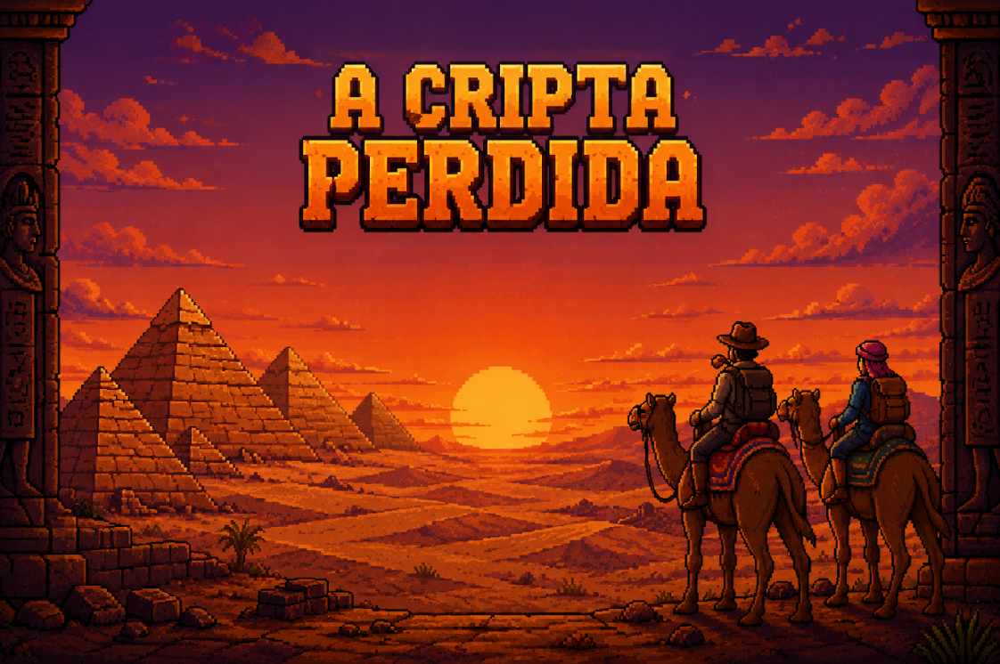

<h1 align="center">A Cripta Perdida</h1>

<p align="center">
  <em>Dois exploradores. Dez pragas. Uma saída.</em>
</p>

<p align="center">
  
</p>

<p align="center">
  
  
  
  
  
</p>

---

## 📜 Sobre

**A Cripta Perdida** é um jogo de ação e puzzle em **co-op local para 2 jogadores**, feito em **JavaScript puro sobre Canvas 2D** — sem engine, sem framework, sem uma única dependência externa.

Uma expedição arqueológica dá errado: a passagem desaba e dois exploradores ficam presos dentro de uma cripta egípcia. Nas paredes, hieróglifos das **10 pragas do Egito** — e elas estão despertando. A única saída é para dentro, selando uma praga de cada vez, até encarar a última delas: o **Anjo da Morte**.

Cada fase é uma praga com uma mecânica própria. Não dá para vencer sozinho.

---

## 🎮 Como jogar

Não precisa instalar nada. Clone e abra:

```bash
git clone https://github.com/<seu-usuario>/cripta-perdida.git
cd cripta-perdida
```

Abra o `index.html` no navegador. Para o áudio e os sprites carregarem sem esbarrar em CORS, o ideal é servir por HTTP:

```bash
python3 -m http.server 8000
# depois acesse http://localhost:8000
```

> 💡 O áudio só começa depois da primeira tecla — é uma regra dos navegadores, não um bug.

---

## ⌨️ Controles

| Ação | 🔵 Player 1 | 🟢 Player 2 |
|:--|:--|:--|
| Mover | `W` `A` `S` `D` | `↑` `←` `↓` `→` |
| Atirar | `F` | `L` |
| Notas da harpa *(Praga I)* | `1` – `7` | `Q` – `U` |
| Ingredientes *(Pragas V–VI)* | `1` `2` `3` | `8` `9` `0` |
| Mecanismo do portão *(Praga VII)* | `ESPAÇO` | `ESPAÇO` |
| Avançar diálogo | `ENTER` | `ENTER` |
| Abrir o manual | `M` (na tela inicial) | — |

---

## 🐛 As pragas

| Fase | Praga | Mecânica |
|:--|:--|:--|
| **Água em Sangue** | I | Toquem a **escala sagrada** na harpa. Cada jogador tem a sua sequência e a sua própria harpa. Errar uma nota zera o progresso — e a água do rio vai do vermelho ao azul conforme vocês acertam. |
| **Rãs, Moscas e Mosquitos** | II – IV | Onda de bichos vindo da direita. Atirem, desviem, eliminem 20. |
| **Peste no Gado e Úlceras** | V – VI | Preparem o **antídoto na ordem certa** seguindo um enigma — errar fere os *dois* jogadores — e destruam as fontes de infecção a tiro. |
| **Chuva de Granizo** | VII | Pedras caindo do céu. Um de vocês precisa segurar `ESPAÇO` no mecanismo para abrir o portão... e ficar parado é exatamente o pior lugar para se estar. |
| **Invasão de Gafanhotos** | VIII | Enxame. Mais rápido, mais denso, e os maiores aguentam dois tiros. |
| **Trevas** | IX | Escuridão total. Vocês só enxergam um pequeno halo de luz ao redor de si. Encontrem a saída do labirinto — e o que está escondido nele. |
| **O Anjo da Morte** | X | O chefe final. Tiro mirado e um **ataque especial a cada 8 segundos** que arranca 3 de vida. Aqui não cai coletável. Boa sorte. |

---

## ✨ Destaques técnicos

Tudo desenhado à mão no Canvas — sem biblioteca, sem atalho.

**🕯️ A escuridão da Praga IX.** Um canvas off-screen é pintado inteiramente de preto; então, com `globalCompositeOperation = 'destination-out'`, um gradiente radial em volta de cada jogador **apaga** esse preto, rasgando um buraco de luz de bordas suaves. A máscara é composta por cima da cena. A sala inteira está lá — você só não pode vê-la.

**🚪 O portão que sobe pela parede.** A porta de pedra é uma imagem deslocada para cima dentro de um `clip()` recortado no vão exato da arte de fundo. Ela não sobe *na frente* da parede: ela some *para dentro* dela.

**🎼 Harpa em escala real.** As sete notas formam a **frígia dominante** — a escala de sonoridade oriental — gravadas uma a uma. Cada tecla toca o som, anima a harpa e solta uma partícula musical. E a água ao fundo interpola de sangue a azul conforme a purificação avança: o feedback está no cenário, não numa barra de UI.

**🏭 Fábrica de fases.** As fases de tiro não foram escritas duas vezes. Uma função `fabricaFaseTiro(cfg)` recebe fundo, meta, spawns, sprites e velocidades — e devolve uma fase pronta.

**🔊 Trilha com *ducking*.** A música de fundo abaixa suavemente para 28% sempre que um efeito sonoro toca, e volta por interpolação. A trilha e as notas da harpa são **autorais**.

---

## 🏆 GoldenCarlos

Espalhados pelas fases existem **5 GoldenCarlos** — um coletável dourado e brilhante. Quatro caem aleatoriamente dos inimigos; **o quinto está escondido no fim de um beco do labirinto às escuras**, onde só chega quem se arrisca a pegar o caminho errado.

Juntem os cinco e os dois exploradores ganham **+5 de vida máxima** para o confronto final. Vocês vão precisar.

---

## 🗂️ Estrutura

```
cripta-perdida/
├── index.html      # canvas, manual do jogo e handler global de erro
├── style.css       # estilo do canvas e do overlay do manual
├── cripta.js       # máquina de estados, FLUXO das fases, HUD, telas e loop principal
├── Fases.js        # as fases, seus objetivos e a fábrica de fases de tiro
├── Util.js         # classes base (Obj/AABB, Player, Inimigo, Boss...) e helpers
├── Cutscenes.js    # roteiro completo e a caixa de diálogo com máquina de escrever
├── assets/         # sprites, fundos, spritesheets e efeitos sonoros
└── audios/         # trilha sonora e as notas da harpa (autorais)
```

**Como funciona por dentro:** o jogo é uma **máquina de estados** (`HOME → CUTSCENE → FASE → GAMEOVER → FINAL`) dirigida por um array `FLUXO`, que descreve a aventura inteira como uma lista de passos. Toda fase é um objeto com o mesmo contrato — `init()`, `atual()`, `des()` e a flag `completa` — de modo que o loop principal nem precisa saber qual fase está rodando. Foi esse contrato que permitiu quatro pessoas desenvolverem fases em paralelo, em branches separadas, sem colidir.

---

## 👥 A equipe

Projeto desenvolvido no **SESI SENAI — Tijucas**, sob orientação do professor **Carlos Roberto**.

| | Responsável por |
|:--|:--|
| **Bello** | Engine e arquitetura (loop, colisão AABB, classe `Player`), HUD, máquina de estados e integração das branches. Toda a **arte** do jogo. |
| **Rafael** | As fases-puzzle: a harpa, o antídoto, o granizo e o labirinto nas trevas — junto com a escuridão dinâmica e o portão. |
| **Rech** | Inimigos, a fábrica de fases de tiro, as animações por spritesheet e o **Anjo da Morte** por completo. |
| **Mario** | Cutscenes com efeito máquina de escrever, telas e manual, cena final e auxilio fases de tiro— e toda a **trilha sonora**. |

Workflow em `main` / `develop` / `feature/*`, com integração por merge a cada release.

---

<p align="center">
  <sub>Feito com JavaScript e muito esforço. 🐪</sub>
</p>
